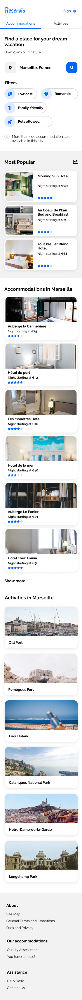

*Transform mockup into responsive one-page HTML/CSS static template*

[My web page hosted online on GitHub Pages](shandean.github.io/reservia/)

## Details of the Mockup

Reservia, a small company offering a vacation planning tool. 
Their site allows users to find accommodations and activities in the city of their choice. 
Accommodations can also be filtered by theme, for example, their budget or their atmosphere.

- The icons come from [Font Awesome library](https://fontawesome.com/). The colors of the chart are blue [#0065FC](https://www.colorhexa.com/0065fc) and its lighter version [#DEEBFF](https://www.color-hex.com/color/deebff), as well as grey for the background [#F2F2](https://www.colorhexa.com/f2f2f2).

- The site font is [Raleway](https://fonts.google.com/specimen/Raleway?preview.text_type=custom).

## This mock-up for desktop

## This Mock-Up for Phone

